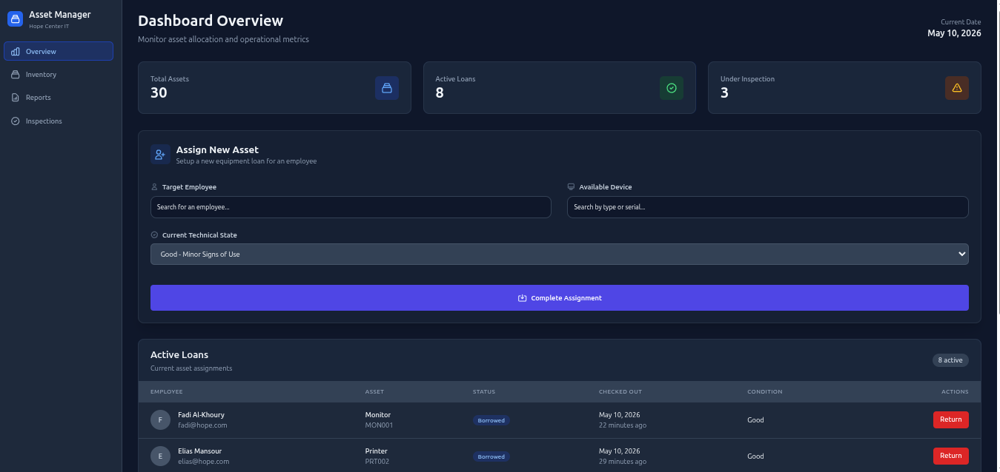
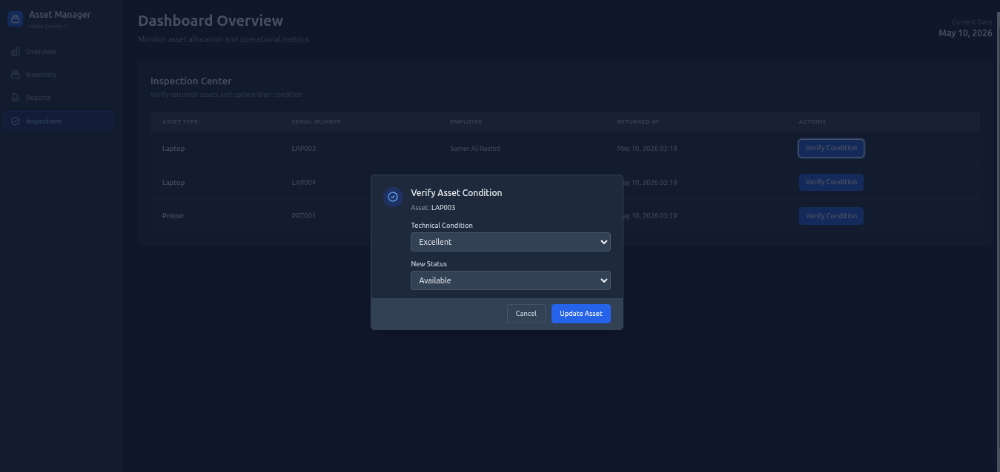
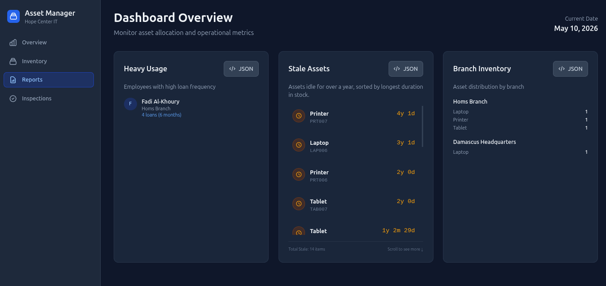

# 🚀 Asset Manager - Hope Center

*Empowering Hope Center's IT Operations with Intelligent Asset Management*

[](https://laravel.com)
[](https://tailwindcss.com)
[](https://alpinejs.dev)
[](https://www.mysql.com)
[](https://tom-select.js.org)

---

## 📋 About the Project

The **Asset Manager - Hope Center** is a sophisticated web application designed to streamline internal IT asset management for Hope Center. Built with modern web technologies, it provides a secure, efficient, and user-friendly platform for tracking equipment loans, returns, inspections, and operational analytics. This system eliminates manual paperwork, reduces asset loss, and ensures accountability in equipment distribution across the organization.

---

## ✨ Key Features

| Feature | Description |
|---------|-------------|
| 🏠 **Dashboard Overview** | Real-time statistics with dynamic charts and key metrics |
| 📊 **Real-time Stats** | Live counters for total assets, active loans, and under-inspection items |
| 🔄 **Asset Assignment** | Intuitive employee-asset pairing with condition tracking |
| 🔍 **Professional Inspection Workflow** | Alpine.js-powered modals for condition verification and status updates |
| 🌙 **Global Dark Mode** | Consistent dark theme across all interfaces for better UX |
| 🔔 **Toast Notifications** | Instant feedback for all user actions (success/error states) |
| 📈 **Operational Reports** | Heavy usage analytics, stale assets tracking, and branch inventory |
| 🔒 **Concurrency Protection** | Database-level safeguards against race conditions in asset borrowing |

---

## 🛠 Tech Stack

- **Backend**: Laravel 11 (PHP 8.2+) - Robust MVC framework with Eloquent ORM
- **Frontend**: Tailwind CSS 3.0 - Utility-first CSS framework for responsive design
- **Interactivity**: Alpine.js 3.x - Lightweight JavaScript framework for reactive components
- **Database**: MySQL 8.0 - Relational database with ACID compliance
- **UI Components**: TomSelect 2.3.1 - Enhanced select dropdowns for better UX

---

## 🚀 Installation Guide

### Prerequisites
- PHP 8.2 or higher
- Composer
- Node.js & npm (for asset compilation, if needed)
- MySQL 8.0

### Step-by-Step Setup

1. **Clone & Install Dependencies**
   ```bash
   git clone https://github.com/kameldeeb/tech-assets-manager.git
   cd tech-assets-manager
   composer install
   npm install
   ```

2. **Environment Setup**
   ```bash
   cp .env.example .env
   php artisan key:generate
   # Configure your DB_DATABASE, DB_USERNAME, DB_PASSWORD in .env
   ```

3. **Database & Assets**
   ```bash
   php artisan migrate --seed
   npm run build
   ```

4. **Run Application**
   ```bash
   php artisan serve
   ```
   Open `http://localhost:8000`

---

## 🔐 Demo Credentials
💡 Note: This project is intended to be run locally. Follow the installation guide below to explore the dashboard.

| Field | Value |
|-------|-------|
| **Email** | admin@hope.com |
| **Password** | password |

*Use these credentials to explore the full functionality of the Asset Manager.*

---

---

## 📸 Screenshots

### 🖥️ Dashboard & Asset Assignment

*The primary control center featuring real-time operational metrics and the intuitive asset assignment interface with TomSelect-powered searchable dropdowns.*

### 🔍 Inspection Center

*Professional inspection workflow with Alpine.js modals for asset condition verification and status updates.*

### 📊 Operational Analytics & Reports

*Comprehensive reporting module featuring Heavy Usage analytics, Stale Assets tracking (idle duration), and Branch-specific inventory distribution.*


---

## 🏗 Project Architecture

This application follows **Clean Code** principles and modern Laravel best practices:

### Service Layer Pattern
- **DashboardService**: Aggregates data for dashboard views
- **LoanService**: Handles loan creation with business rule validation
- **ReturnService**: Manages asset returns and inspection triggers
- **InspectionService**: Processes inspection workflows
- **BranchService**: Provides branch-specific inventory analytics

### Key Architectural Decisions
- **Separation of Concerns**: Controllers delegate business logic to services
- **Eager Loading**: Optimized database queries with relationship loading
- **Enum Usage**: Type-safe status and condition management
- **Transaction Safety**: Database transactions for critical operations
- **Validation Layers**: Request classes for input sanitization

### Database Design
- **Normalized Schema**: Proper relationships between users, assets, loans, and inspections
- **Status Enums**: Controlled vocabularies for asset states
- **Audit Trail**: Complete history tracking for all asset movements

---
## 🛡️ Concurrency Handling & Problem Solving (Scenario #5)

A critical challenge in asset management is handling the "Race Condition" that occurs when one employee returns a device while another attempts to borrow it at the exact same moment. 

### The Challenge
If the system directly flips an asset from **Borrowed** to **Available**, a second employee could claim it before any technical verification occurs. This leads to:
1. **Lost Accountability**: If the device is damaged, we won't know if the first or second employee caused it.
2. **Data Inconsistency**: Simultaneous database updates could lead to "Double Borrowing".

### Our Solution: The Intermediate "Under Inspection" State
To solve this, we implemented a robust workflow and database-level protections:

1. **Mandatory Intermediate State**: 
   When an asset is returned, our `ReturnService` doesn't mark it as `Available`. Instead, it transitions to `Under Inspection`. 
   - The asset remains **locked** for borrowing during this phase.
   - A new **Inspection Record** is automatically generated.

2. **Database-Level Protection (Atomic Operations)**:
   We use **Database Transactions** and **Row-Level Locking** (`lockForUpdate()`) in the `LoanService`. This ensures that even if two requests hit the server at the exact same millisecond, the database will process them sequentially, preventing any "dirty reads" or race conditions.

3. **Accountability Chain**:
   - **Pre-Inspection**: The system logs the condition reported by the returning employee.
   - **Technical Verification**: A dedicated inspector must verify the condition (Excellent, Good, Fair, Needs Repair) and sign off with their `User_ID` and a timestamp (`completed_at`).
   - **Post-Inspection**: Only after the inspector clicks "Verify", the asset is released back to the "Available" pool.

### Result
This ensures a clear "Chain of Custody". If damage is discovered later, the system provides a full audit trail showing the last employee who had it, the inspector who cleared it, and the current holder.

---

## 🤝 Contributing

1. Fork the repository
2. Create a feature branch (`git checkout -b feature/amazing-feature`)
3. Commit your changes (`git commit -m 'Add amazing feature'`)
4. Push to the branch (`git push origin feature/amazing-feature`)
5. Open a Pull Request

---

## 📄 License

This project is proprietary software for Hope Center internal use.

---

*Built with ❤️ for Hope Center's mission to serve the community.*
